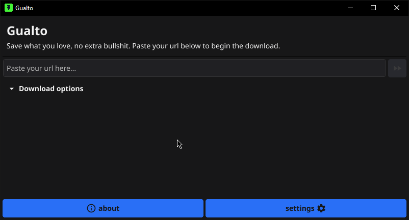
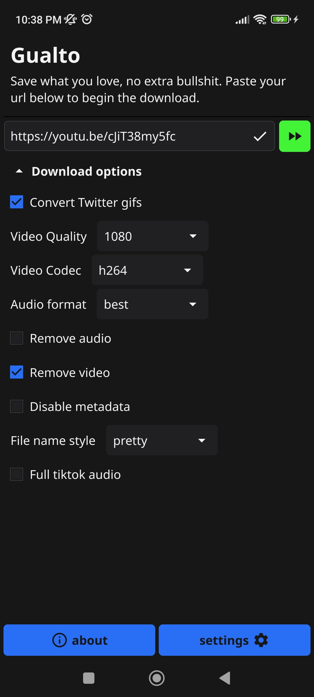
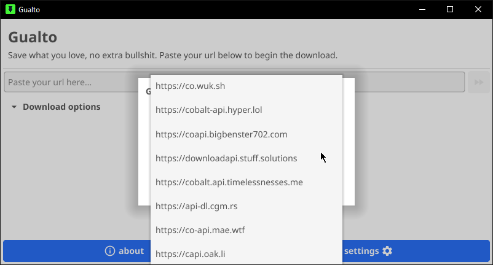

<h1>Gualto</h1>
<!-- Badges -->

[![Static Badge](https://img.shields.io/badge/supported-services-0077b6?style=for-the-badge&logo=data%3Aimage%2Fsvg%2Bxml%3Bbase64%2CPHN2ZyB4bWxucz0iaHR0cDovL3d3dy53My5vcmcvMjAwMC9zdmciIHZpZXdCb3g9IjAgMCA2NDAgNTEyIj48IS0tIUZvbnQgQXdlc29tZSBGcmVlIDYuNS4xIGJ5IEBmb250YXdlc29tZSAtIGh0dHBzOi8vZm9udGF3ZXNvbWUuY29tIExpY2Vuc2UgLSBodHRwczovL2ZvbnRhd2Vzb21lLmNvbS9saWNlbnNlL2ZyZWUgQ29weXJpZ2h0IDIwMjQgRm9udGljb25zLCBJbmMuLS0%2BPHBhdGggZD0iTTU3OS44IDI2Ny43YzU2LjUtNTYuNSA1Ni41LTE0OCAwLTIwNC41Yy01MC01MC0xMjguOC01Ni41LTE4Ni4zLTE1LjRsLTEuNiAxLjFjLTE0LjQgMTAuMy0xNy43IDMwLjMtNy40IDQ0LjZzMzAuMyAxNy43IDQ0LjYgNy40bDEuNi0xLjFjMzIuMS0yMi45IDc2LTE5LjMgMTAzLjggOC42YzMxLjUgMzEuNSAzMS41IDgyLjUgMCAxMTRMNDIyLjMgMzM0LjhjLTMxLjUgMzEuNS04Mi41IDMxLjUtMTE0IDBjLTI3LjktMjcuOS0zMS41LTcxLjgtOC42LTEwMy44bDEuMS0xLjZjMTAuMy0xNC40IDYuOS0zNC40LTcuNC00NC42cy0zNC40LTYuOS00NC42IDcuNGwtMS4xIDEuNkMyMDYuNSAyNTEuMiAyMTMgMzMwIDI2MyAzODBjNTYuNSA1Ni41IDE0OCA1Ni41IDIwNC41IDBMNTc5LjggMjY3Ljd6TTYwLjIgMjQ0LjNjLTU2LjUgNTYuNS01Ni41IDE0OCAwIDIwNC41YzUwIDUwIDEyOC44IDU2LjUgMTg2LjMgMTUuNGwxLjYtMS4xYzE0LjQtMTAuMyAxNy43LTMwLjMgNy40LTQ0LjZzLTMwLjMtMTcuNy00NC42LTcuNGwtMS42IDEuMWMtMzIuMSAyMi45LTc2IDE5LjMtMTAzLjgtOC42Qzc0IDM3MiA3NCAzMjEgMTA1LjUgMjg5LjVMMjE3LjcgMTc3LjJjMzEuNS0zMS41IDgyLjUtMzEuNSAxMTQgMGMyNy45IDI3LjkgMzEuNSA3MS44IDguNiAxMDMuOWwtMS4xIDEuNmMtMTAuMyAxNC40LTYuOSAzNC40IDcuNCA0NC42czM0LjQgNi45IDQ0LjYtNy40bDEuMS0xLjZDNDMzLjUgMjYwLjggNDI3IDE4MiAzNzcgMTMyYy01Ni41LTU2LjUtMTQ4LTU2LjUtMjA0LjUgMEw2MC4yIDI0NC4zeiIvPjwvc3ZnPg%3D%3D&logoColor=0077b6)](https://github.com/wukko/cobalt?tab=readme-ov-file#supported-services)

Unofficial [cobalt](https://cobalt.tools) gui application written in [go](https://go.dev) using [fyne](https://fyne.io). gualto also uses the [gobalt library](https://github.com/princessmortix/gobalt) for communication between your device <-> cobalt servers.

- [Screenshots](#screenshots)
- [Download](#downloading)
- [Roadmap](#roadmap)
- [Usage](#usage)
- [Compiling](#compiling)

## Screenshots

_Desktop: Dark mode_

_Android: Dark mode_

_Desktop: Light mode_

_Gualto in action._

## Download
| **Platform/OS** | **Download link**  |
|-----------------|--------------------|
| Windows         | [**x64**](https://github.com/lostdusty/gualto/releases/latest/download/Gualto.exe) |
| Linux           | Soon!
| MacOS           | [Intel](https://github.com/lostdusty/gualto/releases/latest/download/Gualto-x86-apple.app) / [**M1, M2, M3**](https://github.com/lostdusty/gualto/releases/latest/download/Gualto-m1-m2-m3.app) |
| Android           | [**All**](https://github.com/lostdusty/gualto/releases/latest/download/Gualto.apk) |
| iOS           | [All](https://github.com/lostdusty/gualto/releases/latest/download/Gualto.ipa) / Guide soon! |

You can also check the [releases page](https://github.com/lostdusty/gualto/releases/latest) to download the latest version according to your platform.

## Roadmap
Planned features for gualto:

- [ ] Progress bar with download status;
- [ ] Picker support.
 